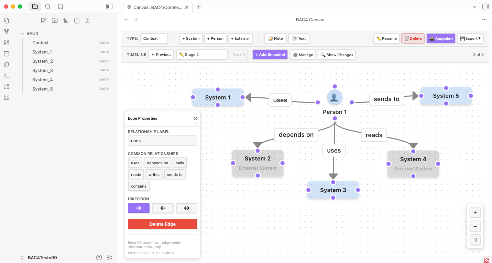

# bac4 - The Solution Architects Toolbox

**Version:** 0.8.0 🎉
**Status:** Production-Ready ✅

An Obsidian plugin that transforms your vault into a comprehensive enterprise architecture management platform. Extends the C4 model with cloud-specific component mappings and provides **THREE WAYS** to create diagrams: manual, AI API, or natural conversation with Claude Desktop via MCP.

> **✨ v0.8.0:** Automatic diagram screenshots in markdown documentation!

---

## 📦 Installation

### Method 1: Community Plugins (Recommended)

> **Note:** Coming soon to Obsidian Community Plugins! For now, use manual installation below.

1. Open Obsidian Settings
2. Navigate to **Community Plugins**
3. Disable **Restricted Mode** (if enabled)
4. Click **Browse** and search for "BAC4"
5. Click **Install**
6. Enable the plugin in the **Installed Plugins** list

### Method 2: Manual Installation from GitHub Release

1. **Download the latest release** from [GitHub Releases](https://github.com/DavidROliverBA/bac4/releases)
   - Download `bac4-v0.8.0.zip`

2. **Extract the files** to your vault's plugins folder:
   ```bash
   # Navigate to your vault's plugins directory
   cd /path/to/your-vault/.obsidian/plugins/

   # Create BAC4 plugin directory
   mkdir bac4

   # Extract the zip contents into the directory
   unzip ~/Downloads/bac4-v0.7.0.zip -d bac4/
   ```

3. **Enable the plugin** in Obsidian:
   - Open Obsidian Settings
   - Go to **Community Plugins**
   - Find "BAC4" in your installed plugins
   - Toggle it **ON**

4. **Reload Obsidian** (Cmd+R on Mac, Ctrl+R on Windows/Linux)

### Method 3: Manual Installation (BRAT)

If you use the [BRAT plugin](https://github.com/TfTHacker/obsidian42-brat):

1. Install and enable BRAT from Community Plugins
2. Open BRAT settings
3. Click **Add Beta plugin**
4. Enter: `DavidROliverBA/bac4`
5. Enable BAC4 in Community Plugins

### Verify Installation

After installation, verify BAC4 is working:

1. Open Command Palette (Cmd+P / Ctrl+P)
2. Type "BAC4"
3. You should see commands like:
   - `BAC4: Open Dashboard`
   - `BAC4: Generate Context Diagram from Description`
   - `BAC4: Import MCP-Generated Diagram`

---

## ✨ Highlights

- 🎨 **Visual C4 Diagram Editor** with drag-and-drop canvas
- ☁️ **Cloud Component Libraries** for AWS, Azure, and GCP
- 🤖 **AI-Powered Diagram Generation** (Anthropic API)
- 💬 **MCP Integration** - Chat with Claude Desktop to generate diagrams
- 🔗 **Hierarchical Navigation** with drill-down (Context → Container → Component)
- 📸 **Automatic Diagram Screenshots** ⭐ **NEW!** - Markdown docs with embedded PNGs
- 📤 **Export** diagrams as PNG, JPEG, or SVG
- 📁 **Git-Native** - All data stored as JSON for version control

---

## 📸 Screenshots

### Visual C4 Canvas Editor with Timeline & Property Panel



**Features shown:**
- **Timeline Navigation** - Multiple snapshots with Previous/Next buttons and snapshot dropdown
- **Canvas Editor** - Visual drag-and-drop diagram with Context level systems and relationships
- **Property Panel** - Edit edge properties, relationship labels, and directions (→, ←, ↔)
- **Common Relationships** - Quick-select from preset labels (uses, depends on, calls, reads, etc.)
- **Sidebar Navigation** - Quick access to all diagrams in your vault
- **Unified Toolbar** - Type selector, node creation buttons, and action buttons

---

## 🚀 Three Ways to Create Diagrams

### **1. Manual Creation** (Full Control)
Drag and drop nodes, connect with edges, customize everything.

### **2. AI API Generation** (Fast & Convenient)
1. Get Anthropic API key
2. Use "Generate Diagram from Description" command
3. Describe architecture in modal
4. Diagram generated in ~5-10 seconds

### **3. MCP Workflow** ⭐ **NEW in v0.2.0!**
1. Chat with Claude Desktop
2. Describe your architecture naturally
3. Claude writes diagram to your vault
4. Run "Import MCP-Generated Diagram"
5. Done! (~3-5 seconds)

**See:** [MCP Workflow Guide](docs/MCP_WORKFLOW_GUIDE.md)

---

## 📋 Features

### **Core Diagram Editor**
- ✅ Visual canvas powered by React Flow
- ✅ Context, Container, and Component diagram types
- ✅ Custom node types (System, Person, Container, Cloud Component)
- ✅ Directional edges with labels (→, ←, ↔)
- ✅ Property panel for editing node/edge properties
- ✅ Auto-save with 1-second debounce
- ✅ Export to PNG, JPEG, SVG

### **Hierarchical Navigation** (v0.6.0 Enhanced)
- ✅ Drill-down: Double-click nodes to open child diagrams
- ✅ Property panel linking: Connect diagrams via dropdowns
- ✅ Auto-create child diagrams with "[+ Create New...]"
- ✅ **NEW:** Self-contained links embedded in nodes (linkedDiagramPath, linkedMarkdownPath)
- ✅ **NEW:** Auto-update references when files are renamed
- ✅ **NEW:** Use Obsidian's native back/forward navigation (breadcrumbs removed)
- ✅ Central relationship tracking in `diagram-relationships.json`

### **Cloud Component Library**
- ✅ AWS services (Lambda, S3, DynamoDB, API Gateway, etc.)
- ✅ Drag & drop cloud components onto Component diagrams
- ✅ Component palette (top-right, context-aware)
- ✅ Extensible to Azure and GCP

### **AI Integration** ⭐ **NEW!**

#### **Anthropic API Method:**
- ✅ Three generation commands (Context, Container, Component)
- ✅ Beautiful description modal with examples
- ✅ Smart response parsing (handles markdown code blocks)
- ✅ Secure API key storage (password-masked)
- ✅ Cost: ~$0.01 per diagram

#### **MCP Method:**
- ✅ Natural conversation with Claude Desktop
- ✅ No API key needed (uses Claude Pro/Max subscription)
- ✅ Direct file writing to vault via MCP
- ✅ One-command import
- ✅ Fastest generation (~3-5 seconds)
- ✅ **Best for:** Complex diagrams, iterative refinement

**See:** [AI Integration Guide](docs/AI_INTEGRATION_COMPLETE.md)

### **Markdown Documentation** ⭐ **NEW in v0.8.0!**
- ✅ **Automatic diagram screenshots** - PNGs embedded in markdown files
- ✅ **Smart heading generation** - "## [Node Label] - [Context/Container/Component] Diagram"
- ✅ **Update Image button** - Refresh screenshots when diagrams change
- ✅ **Three-button workflow:**
  - 📄 **Open File** - Quick access to linked documentation
  - 🔄 **Update Image** - Regenerate diagram screenshot
  - ❌ **Unlink** - Disconnect markdown file
- ✅ **Graceful fallback** - Creates markdown even if screenshot fails
- ✅ **Obsidian wiki-links** - `![[diagram.png]]` format for native display

### **File Management** (v0.6.0 Format)
- ✅ `.bac4` file format (self-contained JSON with metadata)
- ✅ **NEW:** Version tracking (0.6.0)
- ✅ **NEW:** Embedded diagram type, createdAt, updatedAt timestamps
- ✅ **NEW:** Broken link validation and cleanup on load
- ✅ Auto-naming (Generated_context_[timestamp].bac4)
- ✅ Duplicate tab prevention
- ✅ Multi-tab support (each tab independent)
- ✅ Auto-registration in relationships file

---

## 🎯 Quick Start

### **For Users:**

1. **Install the plugin** (from Obsidian Community Plugins or manual install)
2. **Reload Obsidian** (Cmd+R or Ctrl+R)
3. **Create your first diagram:**
   - **Option A:** Cmd+P → "BAC4: Open Dashboard" → Drag nodes manually
   - **Option B:** Cmd+P → "Generate Context Diagram" → Use AI API
   - **Option C:** Chat with Claude Desktop → Import via MCP

### **For MCP Workflow:**

**Prerequisites:**
- Claude Desktop installed (https://claude.ai/download)
- Claude Pro or Max subscription
- obsidian-mcp-tools plugin installed

**Usage:**
1. Open Claude Desktop
2. Say: "Create a Container diagram for [your architecture]"
3. Claude writes file to your vault
4. In Obsidian: Cmd+P → "Import MCP-Generated Diagram"
5. Done! ✨

**Full Guide:** [MCP Workflow Guide](docs/MCP_WORKFLOW_GUIDE.md)

---

## 💻 Development Setup

### **Prerequisites**

- Node.js 18+ and npm
- Obsidian desktop application
- Git

### **Installation**

1. Clone the repository:
   ```bash
   git clone https://github.com/DavidROliverBA/bac4.git
   cd bac4
   ```

2. Install dependencies:
   ```bash
   npm install
   ```

3. Build the plugin:
   ```bash
   npm run build
   ```

4. Link to Obsidian vault for testing:
   ```bash
   # Create a symlink in your vault's plugins folder
   ln -s /path/to/bac4 /path/to/your-vault/.obsidian/plugins/bac4
   ```

5. Enable the plugin in Obsidian:
   - Open Obsidian Settings
   - Go to Community Plugins
   - Enable "BAC4"

### **Development Commands**

```bash
npm run dev          # Watch mode with hot reload
npm run build        # Production build
npm test             # Run unit tests
npm run test:watch   # Tests in watch mode
npm run test:coverage # Coverage report
npm run lint         # Lint TypeScript
npm run format       # Format with Prettier
npm run fix          # Format + lint fix
npm run typecheck    # TypeScript checking
```

### **Project Structure**

```
bac4/
├── src/
│   ├── core/              # Core plugin logic, settings
│   ├── ui/
│   │   ├── canvas-view.tsx       # Main React Flow canvas
│   │   ├── nodes/                # Custom node components
│   │   ├── components/           # UI components (toolbar, panels)
│   │   ├── modals/               # Modal dialogs
│   │   └── settings-tab.ts       # Settings UI
│   ├── services/
│   │   ├── mcp-service.ts        # AI/MCP integration
│   │   ├── component-library-service.ts
│   │   └── diagram-navigation-service.ts
│   ├── data/              # File I/O, parsing
│   ├── utils/             # Utility functions
│   └── main.ts            # Plugin entry point
├── component-library/     # Cloud component definitions
│   ├── aws/
│   └── saas/
├── tests/                 # Unit tests (104 passing, 29.65% coverage)
├── docs/                  # Documentation
│   ├── AI_INTEGRATION_COMPLETE.md
│   ├── MCP_WORKFLOW_GUIDE.md
│   ├── MCP_INTEGRATION_STATUS.md
│   └── CLAUDE.md          # Developer context guide
├── examples/
│   └── mcp-diagram-generation-example.md
├── manifest.json          # Obsidian plugin manifest
└── package.json           # Dependencies
```

---

## 🏗️ Architecture

BAC4 follows a layered plugin architecture:

### **Layers:**

1. **UI Layer** (React + React Flow)
   - Canvas editor with custom nodes/edges
   - Unified toolbar with all controls
   - Property panel for editing
   - Modal dialogs for AI generation

2. **Service Layer**
   - `MCPService` - AI/MCP integration
   - `DiagramNavigationService` - Hierarchy management
   - `ComponentLibraryService` - Cloud component library
   - `ErrorHandler` - Centralized error handling

3. **Data Layer**
   - `.bac4` JSON file format
   - `diagram-relationships.json` for hierarchy
   - File I/O with Obsidian vault API
   - Auto-save with debouncing

### **Key Technologies:**

- **Frontend:** React 19, TypeScript
- **Canvas:** React Flow (XyFlow)
- **AI:** Anthropic SDK, MCP
- **Build:** esbuild
- **Testing:** Jest, ts-jest (104 tests passing)
- **Formatting:** Prettier, ESLint

**Full details:** [CLAUDE.md](CLAUDE.md)

---

## 📊 Test Coverage

| Category | Coverage | Tests | Status |
|----------|----------|-------|--------|
| Overall | 29.65% | 104 passing | ✅ Solid |
| Error handling | 100% | 16 tests | ✅ Complete |
| Auto-naming | 100% | 17 tests | ✅ Complete |
| Canvas utilities | 100% | 43 tests | ✅ Complete |
| Data utilities | 94.39% | 28 tests | ✅ Excellent |

**Target:** 70% coverage for services (deferred - complex mocking)

---

## 🎨 UI Layout (v0.6.0)

```
┌─────────────────────────────────────────────────────────────┐
│ [Type] | [+ Node Buttons] | [Actions] ←─────────────────── │ Unified Toolbar (no breadcrumbs)
├─────────────────────────────────────────────────────────────┤
│                                                    ┌────────┐│
│                                                    │Cloud   ││ Component Palette
│                                                    │Library ││ (moveable/resizable)
│                                                    └────────┘│
│                  CANVAS AREA                                │
│          (React Flow with nodes and edges)                  │
│                                                             │
│ ┌──────────────┐                            ┌─────┐        │
│ │ Property     │                            │ +   │        │ Custom Zoom Controls
│ │ Panel        │ ←──────────────────────────│ −   │        │ (bottom-right)
│ └──────────────┘           (moveable)       │ ⊡   │        │
│                                             └─────┘        │
└─────────────────────────────────────────────────────────────┘
```

**v0.6.0 Changes:**
- ✅ Breadcrumbs removed - use Obsidian's native back/forward navigation
- ✅ Moveable/resizable panels for better customization
- ✅ Export-friendly zoom controls (not captured in exports)

---

## 🤖 AI Features Comparison

| Feature | Manual | API Method | MCP Method |
|---------|--------|------------|------------|
| Setup | None | API key | Already done |
| Speed | Minutes | 5-10 sec | 3-5 sec |
| Cost | Free | $0.01/diagram | Free (with Pro) |
| UX | Full control | Good modal | Natural chat |
| Complexity | Any | Limited tokens | Any size |
| Best For | Custom designs | Quick generation | Complex systems |

---

## 📚 Documentation

- **[CLAUDE.md](CLAUDE.md)** - Complete developer context guide
- **[MCP Workflow Guide](docs/MCP_WORKFLOW_GUIDE.md)** - How to use Claude Desktop integration
- **[AI Integration Complete](docs/AI_INTEGRATION_COMPLETE.md)** - Technical implementation details
- **[MCP Integration Status](docs/MCP_INTEGRATION_STATUS.md)** - Feature status
- **[Example Diagrams](examples/mcp-diagram-generation-example.md)** - Sample use cases
- **[AI Extension Points](docs/AI_EXTENSION_POINTS.md)** - Safe extension guide

---

## 🎯 Roadmap

### **v0.2.0 - AI Integration** ✅ **COMPLETE**
- ✅ Anthropic API integration
- ✅ Three generation commands
- ✅ Description modal with examples
- ✅ MCP workflow support
- ✅ Import command
- ✅ Settings UI

### **v0.3.0 - Enhanced User Experience** ✅ **COMPLETE**
- ✅ Comprehensive installation documentation
- ✅ BRAT plugin support for beta testing
- ✅ Improved onboarding experience
- ✅ GitHub release automation
- ✅ Verified multi-tab stability

### **v0.4.0-v0.5.0 - UI Enhancements** ✅ **COMPLETE**
- ✅ Moveable/resizable panels
- ✅ Enhanced cloud component nodes
- ✅ Custom zoom controls
- ✅ Simplified icon selector
- ✅ Larger container nodes

### **v0.6.0 - Self-Contained Diagrams** ✅ **COMPLETE**
- ✅ New file format with version metadata
- ✅ Embedded links in node.data
- ✅ Auto-update references on file rename
- ✅ Unified navigation priority system
- ✅ Breadcrumbs removed (use Obsidian's native navigation)
- ✅ Broken link validation and cleanup

### **v0.7.0 - Complete Migration** ✅ **COMPLETE**
- ✅ All methods migrated to v0.6.0 architecture
- ✅ PropertyPanel linking fully functional
- ✅ Dropdown shows available diagrams
- ✅ Link/unlink to existing diagrams works
- ✅ Cloud component auto-linking to markdown
- ✅ No diagram-relationships.json dependency

### **v0.8.0 - Markdown Documentation** ✅ **COMPLETE**
- ✅ Automatic diagram screenshots in markdown files
- ✅ Smart heading generation with diagram type
- ✅ Update Image button for refreshing screenshots
- ✅ Three-button workflow (Open, Update, Unlink)
- ✅ Graceful error handling and retry mechanism
- ✅ Obsidian wiki-link format for images

### **v0.9.0 - Multi-Cloud Expansion** (Planned)
- ⏳ Azure component library
- ⏳ GCP component library
- ⏳ Multi-cloud architecture patterns

### **v0.9.0 - Advanced AI Features** (Planned)
- ⏳ Real-time diagram validation
- ⏳ AI suggestions while editing
- ⏳ Diagram improvement command
- ⏳ Documentation generation
- ⏳ Semantic search across diagrams

### **v1.0.0 - Enterprise Features** (Planned)
- ⏳ Planned vs. Actual tracking
- ⏳ Architectural drift detection
- ⏳ Estate dashboard
- ⏳ Team collaboration features

---

## 🤝 Contributing

Contributions are welcome! Please:

1. Read [CLAUDE.md](CLAUDE.md) for developer context
2. Check [AI Extension Points](docs/AI_EXTENSION_POINTS.md) for safe areas to modify
3. Run tests: `npm test`
4. Format code: `npm run fix`
5. Submit PR with clear description

### **Code Quality Standards**

Before committing:

```bash
npm run fix        # Format and lint
npm run typecheck  # Verify types
npm test           # Run tests
npm run build      # Ensure it builds
```

---

## 📄 License

MIT License - see [LICENSE](LICENSE) file for details

---

## 🔗 Links

- **GitHub:** https://github.com/DavidROliverBA/bac4
- **Obsidian:** https://obsidian.md
- **Claude Desktop:** https://claude.ai/download
- **Anthropic API:** https://console.anthropic.com
- **MCP Protocol:** https://modelcontextprotocol.io

---

## 🙏 Acknowledgments

- **Built with:** The BMAD Method (Breakthrough Method of Agile AI-driven Development)
- **AI Partner:** Claude Code (Anthropic)
- **Canvas Library:** React Flow / XyFlow
- **C4 Model:** Simon Brown (https://c4model.com)

---

## 🎉 What's New in v0.8.0

### **Automatic Diagram Screenshots in Markdown Documentation** 📸

Create beautiful, self-documenting architecture with **automatic diagram screenshots** embedded in your markdown files!

#### **What's New:**

**1. Automatic Screenshot Generation**
- When creating markdown files for nodes, BAC4 now automatically:
  - Exports the current diagram as a high-quality PNG
  - Saves it in the same folder as the markdown file
  - Embeds it with a properly formatted heading

**2. Smart Heading Format**
```markdown
## System 1 - Context Diagram
![[System_1.png]]
```
- Heading includes node label and diagram type (Context/Container/Component)
- Obsidian wiki-link format for seamless display

**3. Three-Button Workflow**
When a node has linked documentation, PropertyPanel shows:
- 📄 **Open File** - Quick access to documentation
- 🔄 **Update Image** - Regenerate screenshot after diagram changes
- ❌ **Unlink** - Disconnect markdown file from node

**4. Robust Export with Retry**
- Waits for React Flow to fully render (up to 2.5 seconds)
- Checks for React Flow's internal nodes container
- Graceful fallback: Creates markdown even if screenshot fails
- Clear error messages with helpful suggestions

#### **How to Use:**

1. **Select a node** (System, Container, or CloudComponent)
2. **PropertyPanel → Linked Documentation** → "Link to Markdown File"
3. **Provide a file path** (e.g., `docs/Payment_System.md`)
4. **Click "Create File"**
5. **Done!** Markdown file created with embedded diagram screenshot

**Update screenshots:**
- Modify your diagram (add/move nodes)
- Click **🔄 Update Image** button
- Screenshot regenerates automatically

#### **Technical Details:**

- Uses `html-to-image` library (same as manual export)
- PNG format with high quality settings
- Same folder storage for easy organization
- No external dependencies - works offline
- Graceful error handling preserves workflow

---

## 🎉 What's New in v0.7.0

### **Complete v0.6.0 Migration** ✅

All service methods now use the self-contained .bac4 file format with embedded links. No dependencies on the deprecated `diagram-relationships.json` file.

### **Fixed Methods:**

**linkToExistingDiagram()** - Updates `node.data.linkedDiagramPath` directly in parent diagram file
- PropertyPanel dropdown linking now works correctly
- Select existing diagrams from dropdown to link

**unlinkNode()** - Removes `linkedDiagramPath` from node data
- Select "[NONE]" from dropdown to unlink diagrams
- Clean removal of links without external file updates

**getDiagramsByType()** - Scans vault for .bac4 files by type (v0.6.9)
- PropertyPanel dropdowns now populated correctly
- Shows all available Container/Component diagrams

**updateDiagramType()** - Updates file metadata directly (v0.6.9)
- Diagram type changes persist across reloads
- Metadata timestamps updated automatically

**Cloud Component Auto-linking** (v0.6.8)
- Cloud components automatically create and link markdown files
- Documentation files created in `docs/` folder
- No manual linking required

### **PropertyPanel Now Fully Functional:**
- ✅ Dropdown shows available diagrams
- ✅ Displays current linked diagram name
- ✅ Link to existing diagrams works
- ✅ Unlink diagrams works
- ✅ Diagram type changes persist

---

## 🎉 What's New in v0.6.0

> **⚠️ BREAKING CHANGE:** v0.6.0 introduced a new file format. If upgrading from v0.5.x, see [Migration Guide](#-migration-from-v05x-to-v060) below.

### **Major Features:**

📦 **Self-Contained Diagram Files**
- Version metadata embedded in every .bac4 file
- Diagram type, createdAt, and updatedAt timestamps
- No external dependencies for basic diagram data
- Cleaner, more maintainable file structure

🔗 **Embedded Link System**
- `linkedDiagramPath` stored directly in node.data (replaces external relationships)
- `linkedMarkdownPath` for documentation links
- Auto-validation and cleanup of broken links on load
- Self-healing diagrams - broken references automatically removed

🔄 **Auto-Updating References**
- File rename listener tracks all file operations
- All .bac4 files automatically updated when linked files are renamed
- Metadata timestamps refreshed on updates
- User notification shows count of updated diagrams

🧭 **Unified Navigation**
- Priority-based double-click: linkedDiagramPath → linkedMarkdownPath → drill-down → info
- Simplified navigation logic
- Better user experience

🎨 **UI Simplification**
- Breadcrumbs removed - use Obsidian's native back/forward navigation
- Cleaner toolbar
- Better integration with Obsidian's built-in features
- Reduced visual clutter

### **Technical Updates:**

- ✅ Updated to version 0.6.0 across all manifests
- ✅ New file format: `{ version: "0.6.0", metadata: {...}, nodes: [...], edges: [...] }`
- ✅ vault.on('rename') event listener for auto-updating
- ✅ Removed all breadcrumb-related code
- ✅ Maintained stability: 104 tests passing, 0 TypeScript errors
- ✅ Bundle size: 565.4kb (optimized)

---

## 🔄 Migration from v0.5.x to v0.6.0

**⚠️ IMPORTANT:** v0.6.0 introduces a **breaking change** in the file format. Follow these steps:

### **Before Upgrading:**

1. **Backup your vault** (recommended)
2. **Export important diagrams** as PNG/SVG if needed
3. **Note your architecture** - you'll recreate diagrams from scratch

### **Upgrade Steps:**

1. **Delete all existing .bac4 files:**
   ```bash
   # Navigate to your vault
   cd /path/to/your-vault

   # Find and delete all .bac4 files
   find . -name "*.bac4" -delete

   # Also delete diagram-relationships.json if it exists
   rm diagram-relationships.json
   ```

2. **Update the plugin:**
   - Method 1: Wait for Community Plugins update
   - Method 2: Download v0.6.0 from GitHub Releases
   - Method 3: Update via BRAT

3. **Reload Obsidian:**
   - Press Cmd+R (Mac) or Ctrl+R (Windows/Linux)

4. **Start fresh:**
   - Create new diagrams using the new v0.6.0 format
   - Enjoy improved navigation and auto-updating references!

### **Why This Breaking Change?**

The new format provides:
- ✅ **Self-contained files** - All metadata embedded
- ✅ **Auto-updating** - File renames tracked automatically
- ✅ **Better reliability** - Broken links auto-cleaned
- ✅ **Simpler navigation** - Use Obsidian's native back/forward
- ✅ **Future-proof** - Version tracking for future migrations

**Note:** No migration code was implemented because the architectural changes were too significant. Starting fresh ensures a clean, consistent experience.

---

## 📜 Previous Releases

### v0.8.0 - Markdown Documentation (2025-10-15)
- 📸 Automatic diagram screenshots in markdown files
- 🔄 Update Image button for refreshing screenshots
- 📝 Smart heading generation with diagram type
- 🔧 Robust React Flow export with retry mechanism
- ✨ Three-button workflow (Open, Update, Unlink)

### v0.7.0 - Complete Migration (2025-10-14)
- ✅ All methods migrated to v0.6.0 architecture
- ✅ PropertyPanel linking fully functional
- ✅ Cloud component auto-linking
- ✅ No diagram-relationships.json dependency

### v0.6.0 - Self-Contained Diagrams (2025-10-14)
- 🔄 New file format with embedded metadata
- 🔗 Embedded links in node.data
- 🔄 Auto-update references on file rename
- ⚠️ Breaking change: Required deletion of old .bac4 files

### v0.5.0 - UI Enhancements (2025-10-14)
- 🎨 Moveable/resizable panels
- ☁️ Enhanced cloud component nodes
- 🔍 Custom zoom controls
- 📏 Larger container nodes

### v0.4.0 - Stability & Polish (2025-10-14)
- 🔧 Multi-tab rendering fixes
- 📊 Performance optimizations
- ♿ Accessibility improvements
- 🧪 Test coverage: 29.65%

### v0.3.0 - Installation & Docs (2025-10-13)
- 📦 Enhanced installation documentation
- 🔌 BRAT plugin support
- 📚 Improved onboarding

### v0.2.0 - AI Integration (2025-10-13)
- 🎨 AI-Powered diagram generation (API + MCP)
- 💬 Claude Desktop integration via MCP
- ⚙️ Settings UI for API configuration
- 📊 Complete documentation and examples

### v0.1.0 - Core Features (2025-10-12)
- 🎨 Visual C4 diagram editor
- 🔗 Hierarchical navigation and drill-down
- ☁️ AWS component library
- 📤 PNG/JPEG/SVG export

---

🤖 **Powered by AI, built for humans!**

*Last updated: 2025-10-15 (v0.8.0)*

